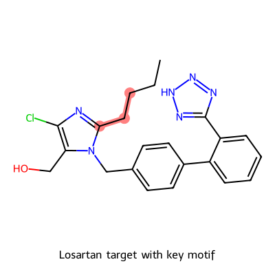
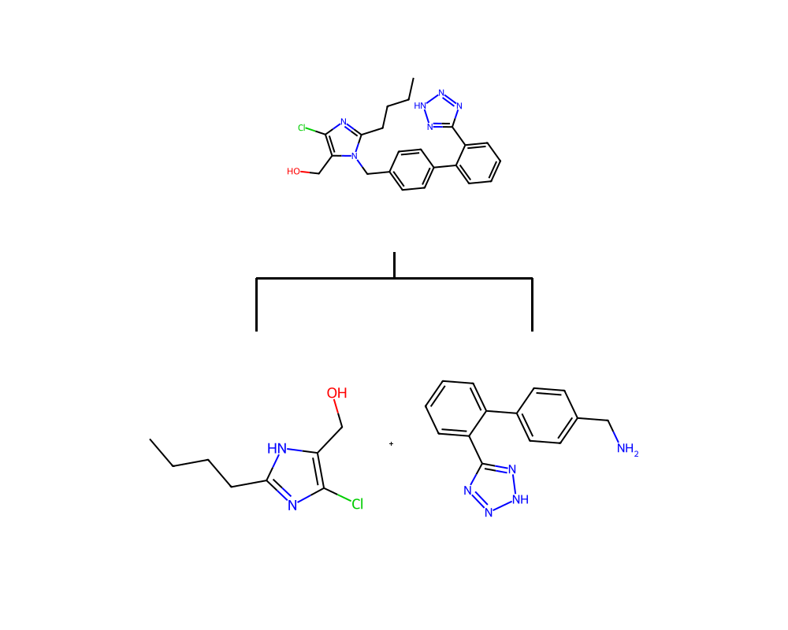
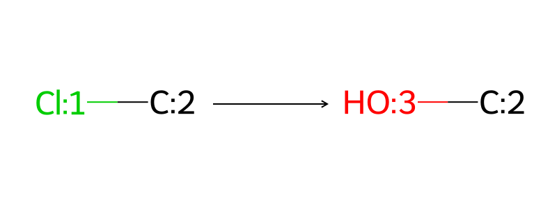

# Retrosynthesis Analysis Report
**Target Molecule**: `CCCCC1=NC(Cl)=C(CO)N1CC2=CC=C(C3=CC=CC=C3C4=NNN=N4)C=C2`

## 1. Executive Summary (Deep Chemical Audit)
- **Core Skeleton**: Biaryl-imidazole
- **Complexity**: Tetrazole, Biphenyl
- **Strategy**: **Convergent**

## 2. Recommended Routes
### Route 1 (Score: 9.0/10 - PASS)

#### Auditor's Verdict
- **Critical Issues**: None

#### Detailed Steps
**Step 1: Hydrolysis**
- **Reagents**: NaOH, H2O
- **Conditions**: Reflux, 4h

## 3. Recommended Next Steps
1. Verify availability of Key Starting Materials (KSMs) for Route 1.
2. Run *Conformer Generation* (Module 4) on late-stage intermediates to check steric hindrance.
3. Review safety flags for Scale-up.