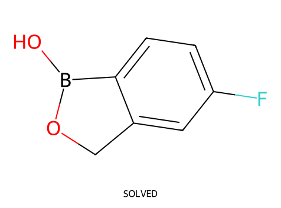
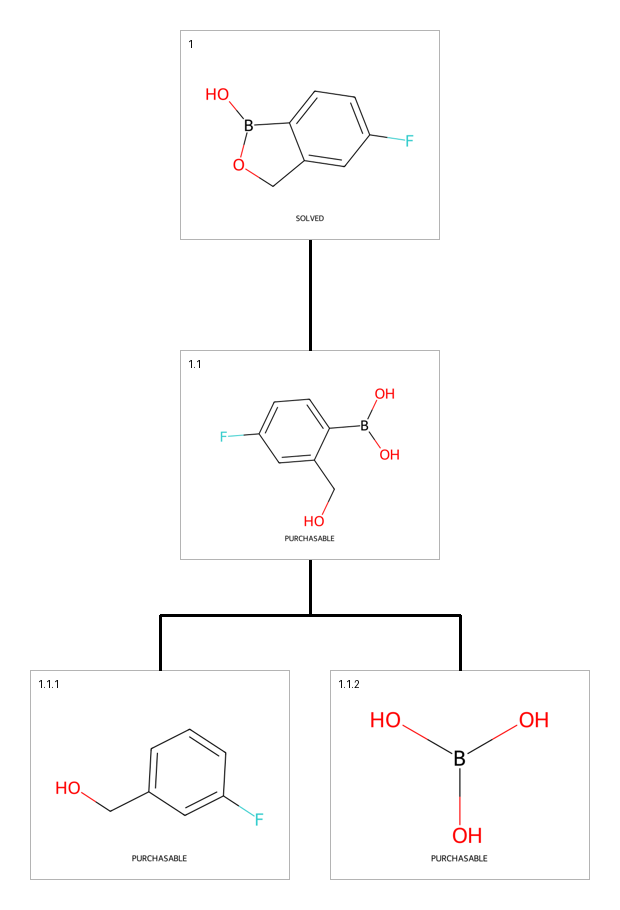
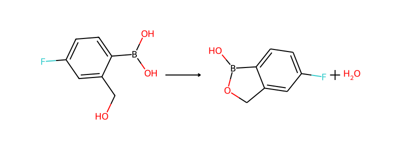
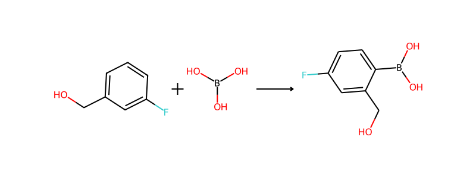

# 逆合成分析报告：环硼酸酯 OB1OCc2cc(F)ccc21

**分析模式**: 交互模式 (run_skill.py)
**分析日期**: 2026-02-11
**目标分子**: `OB1OCc2cc(F)ccc21`
**IUPAC参考名**: 2-(4-氟-2-(羟甲基)苯基)-1,3,2-二氧杂硼杂环戊烷

---

## 1. 目标分子概览

| 属性 | 值 |
|---|---|
| 规范SMILES | `OB1OCc2cc(F)ccc21` |
| 分子量 | 151.9 |
| SAScore | 2.92 |
| 环系统 | 稠合双环 (5元硼酸酯环 + 6元芳香环) |
| 官能团 | 环硼酸酯、B-O键、芳香环、氟取代基 |
| 可断键数 | 6 (均为稠合环系统中的非芳香键) |



---

## 2. 策略决策

| 决策项 | 结果 |
|---|---|
| 合成策略 | **线性** (linear) |
| 复杂度评分 | 3.35 |
| 环系统类型 | 桥接多环 (bridged polycyclic) |
| 关键挑战 | 稠合环系统中所有可断键均为环键，break_bond只能开环不能断裂分子 |

---

## 3. 合成路线总览



```
OB1OCc2cc(F)ccc21  (目标, SAScore=2.92)
  │
  ├── Step 1: 分子内脱水环化 (逆向=开环水解)
  │
  └── OCc1cc(F)ccc1B(O)O  (2-(羟甲基)-4-氟苯硼酸, SAScore=2.61, 可购买)
        │
        ├── Step 2: C-B键形成 (硼化反应)
        │
        ├── OCc1cccc(F)c1  (3-氟苄醇, SAScore=1.48, 可购买)
        └── OB(O)O          (硼酸, SAScore=1.0, 大宗化学品)
```

---

## 4. 逐步分析记录

### Step 1: 分子内脱水环化

**技能调用**: `decide_strategy` → `analyze_molecule` → `break_bond` (多次失败) → `propose_disconnection` (无匹配规则) → 化学知识推理

**核心决策过程**:
1. `break_bond` 尝试断裂环内B-O键 (atom 0-1)、C-O键等 → 全部失败（环键只能开环，不能将分子断裂为两个片段）
2. `propose_disconnection` 返回空结果 — 硼酸酯环化无匹配的断裂规则
3. **化学知识介入**: 识别正确的逆合成为分子内脱水环化的逆反应（开环水解），前体为开链形式的2-(羟甲基)-4-氟苯硼酸

**反应SMILES**: `OCc1cc(F)ccc1B(O)O >> OB1OCc2cc(F)ccc21 + H2O`

| 验证项 | 结果 |
|---|---|
| validate_reaction | ✅ is_valid=true |
| 原子平衡 | 通过 (需显式包含H2O副产物) |
| 反应类型 | 分子内脱水环化 |
| 条件 | 温和酸催化，室温，脱水条件 |



### Step 2: C-B键形成 (深度追溯)

**技能调用**: `check_precursor_availability` → `break_bond` (C-B键) → `check_precursor_availability`

**核心决策过程**:
1. 前体 `OCc1cc(F)ccc1B(O)O` SAScore=2.61，已可购买
2. 深度追溯：断裂C-B键 → 得到3-氟苄醇 + 硼酸，均为大宗化学品
3. 两条路径均可行：直接购买前体 或 从更基础原料合成

**反应SMILES**: `OCc1cccc(F)c1.OB(O)O >> OCc1cc(F)ccc1B(O)O`

| 验证项 | 结果 |
|---|---|
| validate_reaction | ✅ is_valid=true |
| 反应类型 | C-B键形成 (Miyaura硼化 或 定向C-H硼化) |
| 条件 | Pd催化剂, bis(pinacolato)diboron, 碱, 80-100°C |



---

## 5. 前体可购买性汇总

| 前体 | SMILES | SAScore | 状态 |
|---|---|---|---|
| 2-(羟甲基)-4-氟苯硼酸 | `OCc1cc(F)ccc1B(O)O` | 2.61 | ✅ 可购买 |
| 3-氟苄醇 | `OCc1cccc(F)c1` | 1.48 | ✅ 可购买 |
| 硼酸 | `OB(O)O` | 1.0 | ✅ 可购买 (大宗化学品) |

---

## 6. 关键发现与经验

### 6.1 环硼酸酯的逆合成挑战
- **break_bond对环键的局限**: 稠合环系统中的键只能"开环"而非"断裂分子"，这是工具的固有限制
- **propose_disconnection的覆盖盲区**: 硼酸酯环化不在当前规则库中
- **解决方案**: 需要LLM的化学知识来识别正确的逆合成路径（分子内脱水环化逆反应）

### 6.2 验证器的副产物处理
- 初始验证可能因未推断H2O副产物而返回false
- **解决方案**: 在产物侧显式包含副产物 (`.O`)

### 6.3 推荐合成路线
**最优路线 (1步)**:
直接购买 `OCc1cc(F)ccc1B(O)O`，酸催化脱水环化得到目标产物

**备选路线 (2步)**:
1. 3-氟苄醇 + 硼酸 → Pd催化硼化 → 2-(羟甲基)-4-氟苯硼酸
2. 酸催化脱水环化 → 目标产物

---

## 7. 输出文件清单

| 文件 | 路径 | 说明 |
|---|---|---|
| 合成树图 | `images/synthesis_tree.png` | 多步正交树状图 |
| 目标分子图 | `images/target.png` | 目标分子结构 |
| 前体1图 | `images/precursor_boronic_acid.png` | 苯硼酸前体 |
| 前体2图 | `images/precursor_fluorobenzyl_alcohol.png` | 氟苄醇 |
| 前体3图 | `images/precursor_boric_acid.png` | 硼酸 |
| 环化反应图 | `images/step1_cyclization_reaction.png` | 脱水环化 |
| 硼化反应图 | `images/step2_borylation_reaction.png` | C-B键形成 |
| 逆合成图JSON | `../retro_graph.json` | RetroGraph完整数据 |
| 决策日志 | `../decision_log.json` | 核心决策记录 |
